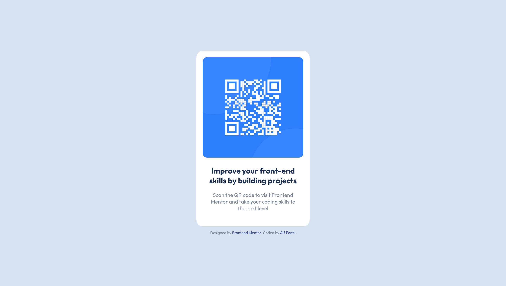

# Frontend Mentor - QR code component solution

This is a solution to the [QR code component challenge on Frontend Mentor](https://www.frontendmentor.io/challenges/qr-code-component-iux_sIO_H). Frontend Mentor challenges help you improve your coding skills by building realistic projects. 

## Table of contents

- [Overview](#overview)
  - [Screenshot](#screenshot)
  - [Links](#links)
- [My process](#my-process)
  - [Built with](#built-with)
  - [Useful resources](#useful-resources)
- [Author](#author)

## Overview

### Screenshot

### Links

- Solution URL: [https://github.com/Alffonti/qr-code-component](https://github.com/Alffonti/qr-code-component)
- Live Site URL: [https://qr-code-component-by-alf.netlify.app](https://qr-code-component-by-alf.netlify.app/)

## My process

### Built with

- Semantic HTML5 markup
- CSS custom properties
- Flexbox
- CSS Grid
- Mobile-first workflow
- [React](https://reactjs.org/) - JS library

### Useful resources

- [Add Sass to your React App](https://medium.com/nerd-for-tech/add-sass-to-your-react-app-in-2021-here-is-how-c7260c323a5a) - This helped get Sass set up in my React app.
- [Understanding ReactJs Project Structure and Folder Setups](https://www.xenonstack.com/insights/reactjs-project-structure)
- [How to create the Best React File Structure](https://medium.com/an-idea/how-to-create-the-best-react-file-structure-dd7eb51aa051)
- [React Project Folder Structure](https://dev.to/knitesh/react-project-folder-structure-30cm)
- [bulletproof-react](https://github.com/alan2207/bulletproof-react/blob/master/docs/project-structure.md) - This is another React project folder structure.

## Author

- Website - [alffonti.netlify.app](https://alffonti.netlify.app/)
- Frontend Mentor - [@alffonti](https://www.frontendmentor.io/profile/Alffonti)
- Twitter - [@alphfonti](https://twitter.com/alphfonti)

